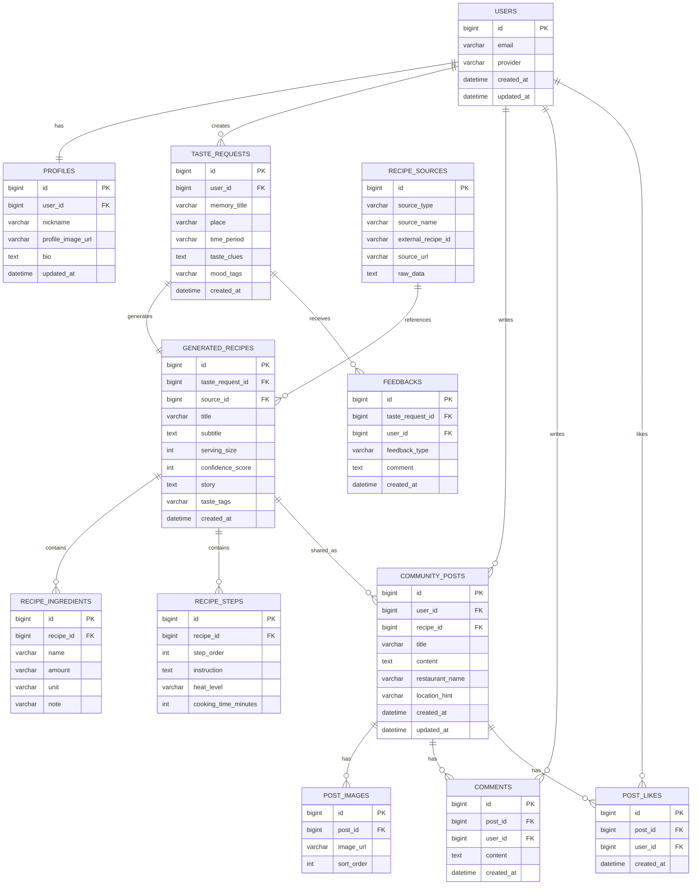

# 🍓 맛나리오 Matnario

> **AI가 기억 속 맛을 1인분 레시피로 복원해주는 귀여운 모바일 웹앱**

맛나리오는 사용자가 “초등학교 앞 카레향 떡볶이”, “할머니가 끓여주던 잔치국수”처럼 기억 속 음식 단서를 입력하면, CSV 레시피 데이터·식품안전나라 공공 레시피 API·Gemini API를 활용해 **실제로 조리 가능한 1인분 기준 레시피**를 생성하는 서비스입니다.

마스코트가 사용자를 안내하는 챗봇형 UX, 딸기우유 계열의 말랑한 UI, 레시피 공유 커뮤니티, 나의 복원 기록, 프로필 기능을 포함합니다.

---

## 🔗 배포 링크

```txt
추후 Vercel 배포 URL을 입력하세요.
```

---

## ✨ 주요 기능

### 1. AI 맛 복원

사용자가 음식 이름, 장소, 시기, 맛 단서, 감정 키워드를 입력하면 AI가 기억 속 맛을 추론합니다.

- 1인분 기준 레시피 생성
- g, ml, 큰술, 작은술, 개, 장 등 구체 계량 제공
- 불 세기와 조리 시간 포함
- 비슷한 레시피 후보 기반으로 복원
- Gemini API가 없을 때도 로컬 생성 엔진으로 동작

### 2. 피드백

복원된 레시피에 대해 사용자가 평가할 수 있습니다.

- `이맛 맞아!`
- `조금 달라요`

피드백은 기록에 저장되어 이후 서비스 개선 데이터로 활용할 수 있습니다.

### 3. 커뮤니티

사람들이 추억 음식과 레시피를 공유할 수 있는 공간입니다.

- 글 작성
- 사진 업로드
- 복원 레시피 공유
- 좋아요 기능
- 같은 식당, 같은 동네, 비슷한 시절의 음식을 그리워하는 사용자 연결

### 4. 기록

내가 지금까지 요청했던 맛 복원 결과를 확인할 수 있습니다.

- 복원 음식 리스트 확인
- 이전 결과 다시 보기
- 피드백 상태 확인
- 기록 삭제

### 5. 마이페이지

사용자 프로필을 등록하고 관리할 수 있습니다.

- 닉네임 등록
- 프로필 사진 등록
- 소개글 등록
- 복원 기록 및 공유 글 수 확인

---

## 🎯 사용자 타깃

### 핵심 타깃

- 20~30대 모바일 앱 사용자
- SNS에 음식 사진, 추억, 장소 경험을 공유하는 사용자
- “그때 그 맛”을 다시 찾고 싶은 사용자
- AI 서비스를 재미있게 체험하고 싶은 사용자

### 확장 타깃

- 가족 음식, 학교 앞 음식, 동네 맛집을 기억하는 40~60대
- 레시피를 직접 재현하고 싶은 홈쿡 사용자
- 지역 기반 추억 음식 커뮤니티에 관심 있는 사용자
- 예능형 AI 콘텐츠와 푸드테크에 관심 있는 사용자

---

## 👤 페르소나

### Persona 1. 추억 음식 탐색형 사용자

| 항목 | 내용 |
|---|---|
| 이름 | 김민지 |
| 나이 | 24세 |
| 직업 | 대학생 |
| 특징 | SNS에 맛집과 일상 기록을 자주 올림 |
| 니즈 | 초등학교 앞에서 먹던 달달한 떡볶이 맛을 다시 찾고 싶음 |
| 사용 시나리오 | “학교 앞 떡볶이, 카레 향, 달달매콤함”을 입력하고 1인분 레시피를 받아 직접 조리 |

### Persona 2. 가족 음식 회상형 사용자

| 항목 | 내용 |
|---|---|
| 이름 | 박성훈 |
| 나이 | 36세 |
| 직업 | 직장인 |
| 특징 | 자취 중이며 집밥과 가족 음식을 그리워함 |
| 니즈 | 할머니가 해주던 잔치국수 맛을 재현하고 싶음 |
| 사용 시나리오 | 장소, 시기, 재료 단서를 입력하고 복원 결과를 가족과 공유 |

### Persona 3. 커뮤니티 공유형 사용자

| 항목 | 내용 |
|---|---|
| 이름 | 이수아 |
| 나이 | 29세 |
| 직업 | 콘텐츠 마케터 |
| 특징 | 레트로 감성과 음식 스토리에 관심이 많음 |
| 니즈 | 사라진 동네 식당의 맛을 비슷하게 기억하는 사람들과 소통하고 싶음 |
| 사용 시나리오 | 커뮤니티에 사진과 글을 올리고 다른 사용자의 레시피를 참고 |

---

## 🛠 기술 스택

### Frontend

| 기술 | 역할 |
|---|---|
| Next.js 14 App Router | 앱 라우팅, API Route, 배포 구조 |
| React 18 | 컴포넌트 기반 UI 구현 |
| TypeScript | 타입 안정성 확보 |
| CSS Modules가 아닌 Global CSS | 말랑한 딸기우유 톤 디자인 시스템 구현 |
| localStorage | 기록, 커뮤니티 글, 프로필 데이터 임시 저장 |

### Backend

| 기술 | 역할 |
|---|---|
| Next.js Route Handler | `/api/recipes/restore` API 구현 |
| Gemini API | 자연어 기반 레시피 복원 생성 |
| 식품안전나라 조리식품 레시피 API | 공공 레시피 후보 검색 |
| CSV Seed Data | 만개의레시피 CSV를 정제한 검색용 로컬 데이터 |
| Local Restore Engine | Gemini 키가 없을 때도 동작하는 fallback 레시피 생성 |

### Data

| 데이터 | 활용 방식 |
|---|---|
| `data/recipes.seed.json` | CSV에서 필요한 필드만 추출한 검색용 seed 데이터 |
| FoodSafety Open API | 음식명 키워드로 공공 레시피 후보 조회 |
| 사용자 입력 데이터 | 음식명, 장소, 시기, 맛 단서, 감정 태그 |
| 사용자 피드백 | “이맛 맞아!” / “조금 달라요” 저장 |

---

## 🧱 프로젝트 구조

```txt
matnario-pro-app
├── app
│   ├── api
│   │   └── recipes
│   │       └── restore
│   │           └── route.ts
│   ├── globals.css
│   ├── layout.tsx
│   └── page.tsx
├── data
│   └── recipes.seed.json
├── lib
│   ├── foodsafe.ts
│   ├── gemini.ts
│   ├── recipe-search.ts
│   ├── restore-engine.ts
│   └── types.ts
├── public
│   ├── assets
│   │   ├── mascot-chef.png
│   │   ├── mascot-recipe.png
│   │   ├── mascot-pair.png
│   │   ├── food-noodle.png
│   │   ├── food-steak.png
│   │   └── food-tteokbokki.png
│   └── manifest.json
├── scripts
│   └── build-seed.mjs
├── .env.example
├── next.config.mjs
├── package.json
└── README.md
```

---

## 🔄 서비스 동작 흐름

```txt
사용자 맛 기억 입력
        ↓
/api/recipes/restore 호출
        ↓
CSV seed 데이터에서 유사 레시피 검색
        ↓
식품안전나라 Open API에서 공공 레시피 추가 검색
        ↓
Gemini API가 있으면 AI 생성
        ↓
Gemini API가 없으면 로컬 복원 엔진 실행
        ↓
1인분 기준 복원 레시피 반환
        ↓
사용자 피드백 및 기록 저장
```

---

## 🗂 ERD

GitHub README에서는 아래 Mermaid ERD가 바로 렌더링됩니다. PNG 파일로 저장하고 싶다면 이 다이어그램을 Mermaid Live Editor 또는 VS Code Mermaid 확장으로 내보낸 뒤 `docs/erd.png`에 저장하면 됩니다.



---

## 💻 주요 코드 설명

### 1. 레시피 복원 API Route

`app/api/recipes/restore/route.ts`

사용자 입력을 검증한 뒤 `restoreRecipe()`를 호출해 레시피를 생성합니다.

```ts
export async function POST(request: Request) {
  try {
    const body = await request.json();
    const input = validate(body);
    const result = await restoreRecipe(input);

    return NextResponse.json(result);
  } catch (error) {
    const message = error instanceof Error
      ? error.message
      : "레시피 복원 중 문제가 발생했어요.";

    return NextResponse.json({ message }, { status: 400 });
  }
}
```

이 API는 프론트엔드에서 `fetch('/api/recipes/restore')`로 호출됩니다.

---

### 2. CSV Seed 기반 유사 레시피 검색

`lib/recipe-search.ts`

사용자의 음식 단서를 토큰화하고, 유의어를 확장한 뒤 CSV seed 데이터에서 유사 레시피를 검색합니다.

```ts
export function findSimilarRecipes(input: RestoreRequest, limit = 8): SimilarRecipe[] {
  const rawQuery = `${input.memoryTitle} ${input.place} ${input.time} ${input.clues} ${input.mood.join(" ")}`;
  const tokens = tokenize(rawQuery);

  const scored = seedRecipes
    .map((recipe) => ({ recipe, score: scoreRecipe(recipe, tokens, rawQuery) }))
    .filter((item) => item.score > 5)
    .sort((a, b) => b.score - a.score)
    .slice(0, limit);

  return scored.map(({ recipe, score }) => ({
    id: recipe.id,
    title: recipe.title || recipe.name,
    summary: recipe.intro,
    ingredients: recipe.ingredients,
    source: "csv",
    score: Math.round(score)
  }));
}
```

이를 통해 AI가 아무 근거 없이 레시피를 만드는 것이 아니라, 기존 레시피 데이터를 참고하도록 설계했습니다.

---

### 3. 식품안전나라 Open API 연동

`lib/foodsafe.ts`

환경변수에 `FOODSAFETY_API_KEY`가 있으면 공공 레시피 API를 함께 조회합니다.

```ts
const url = `https://openapi.foodsafetykorea.go.kr/api/${key}/${serviceId}/json/1/20/RCP_NM=${keyword}`;

const response = await fetch(url, {
  next: { revalidate: 60 * 60 * 12 }
});

const data = await response.json();
const rows = data?.[serviceId]?.row ?? [];
```

공공 레시피 후보는 Gemini 프롬프트의 참고 데이터로 들어가며, API 키가 없으면 CSV seed 데이터만 사용합니다.

---

### 4. Gemini API 기반 레시피 생성

`lib/gemini.ts`

Gemini에는 “1인분 기준”, “정확한 계량”, “추상 표현 금지” 같은 제약 조건을 프롬프트로 전달합니다.

```ts
const body = {
  contents: [
    {
      role: "user",
      parts: [{ text: buildPrompt(input, similarRecipes) }]
    }
  ],
  generationConfig: {
    temperature: 0.35,
    topP: 0.9,
    responseMimeType: "application/json"
  }
};
```

Gemini 응답은 JSON으로 파싱되어 프론트엔드 결과 화면에 표시됩니다.

---

### 5. 프론트엔드 복원 요청

`app/page.tsx`

사용자가 맛 단서를 입력하고 제출하면 로딩 화면을 보여준 뒤 백엔드 API를 호출합니다.

```tsx
const submit = async (event: FormEvent) => {
  event.preventDefault();
  setResult(null);
  setActiveStep(0);
  setView("loading");

  const response = await fetch("/api/recipes/restore", {
    method: "POST",
    headers: { "Content-Type": "application/json" },
    body: JSON.stringify(form)
  });

  const data = await response.json();
  const restored = data as RestoreResult;

  setResult(restored);
  saveHistory([nextItem, ...history].slice(0, 80));
  setView("result");
};
```

로딩 중에는 레시피 마스코트가 둥둥 떠 있는 애니메이션 화면이 표시됩니다.

---

### 6. 사용자 기록 저장

`app/page.tsx`

현재 MVP에서는 별도 DB 대신 브라우저 `localStorage`에 기록, 커뮤니티 글, 프로필을 저장합니다.

```ts
function readStorage<T>(key: string, fallback: T): T {
  if (typeof window === "undefined") return fallback;

  try {
    const raw = window.localStorage.getItem(key);
    return raw ? (JSON.parse(raw) as T) : fallback;
  } catch {
    return fallback;
  }
}

function writeStorage<T>(key: string, value: T) {
  if (typeof window === "undefined") return;
  window.localStorage.setItem(key, JSON.stringify(value));
}
```

향후 Supabase, Firebase, PostgreSQL 등을 연결하면 이 구조를 실제 DB 저장 방식으로 확장할 수 있습니다.

---

## ⚙️ 실행 방법

```bash
npm install
cp .env.example .env.local
npm run dev
```

브라우저에서 아래 주소를 엽니다.

```txt
http://localhost:3000
```

---

## 🔐 환경변수

`.env.local`에 실제 키를 넣습니다.

```env
GEMINI_API_KEY=
GEMINI_MODEL=gemini-1.5-flash

FOODSAFETY_API_KEY=
FOODSAFETY_SERVICE_ID=COOKRCP01
```

`.env.example`에는 실제 키를 넣지 않습니다.

```env
GEMINI_API_KEY=
GEMINI_MODEL=gemini-1.5-flash

FOODSAFETY_API_KEY=
FOODSAFETY_SERVICE_ID=COOKRCP01
```

---

## 🚀 배포 방법

### 1. 빌드 확인

```bash
npm run build
```

### 2. GitHub 업로드

```bash
git init
git add .
git commit -m "feat: initial matnario app"
git branch -M main
git remote add origin https://github.com/사용자명/matnario-pro-app.git
git push -u origin main
```

### 3. Vercel 배포

Vercel에서 GitHub 저장소를 연결하고, Environment Variables에 아래 값을 등록합니다.

```env
GEMINI_API_KEY=새로 발급한 Gemini API Key
GEMINI_MODEL=gemini-1.5-flash
FOODSAFETY_API_KEY=식품안전나라 API Key
FOODSAFETY_SERVICE_ID=COOKRCP01
```

---

## ⚠️ 보안 및 데이터 주의사항

- `.env.local`은 GitHub에 올리지 않습니다.
- API 키가 화면 캡처나 GitHub에 노출되었다면 즉시 삭제 후 재발급합니다.
- 만개의레시피 CSV는 사용권과 재배포 가능 여부를 확인한 뒤 공개 배포에 포함해야 합니다.
- 권리가 애매한 경우 공개 배포본은 공공데이터와 직접 작성한 seed 데이터 위주로 구성하는 것이 안전합니다.
- 현재 MVP의 커뮤니티/기록/프로필은 `localStorage` 기반이므로 기기별로만 저장됩니다.

---

## 🧭 향후 개선 방향

- Supabase 또는 PostgreSQL 기반 실제 DB 연결
- 사용자 로그인 기능
- 커뮤니티 댓글 기능 고도화
- 레시피 이미지 생성 또는 업로드 기능
- 사용자 피드백 기반 추천 정확도 개선
- 유사 식당/지역 기반 추억 음식 매칭
- PWA 설치 지원 강화

---

## 📌 한 줄 소개

**맛나리오는 사라진 기억 속 음식을 AI와 데이터로 다시 찾아주는, 귀여운 추억 맛 복원 앱입니다.**
